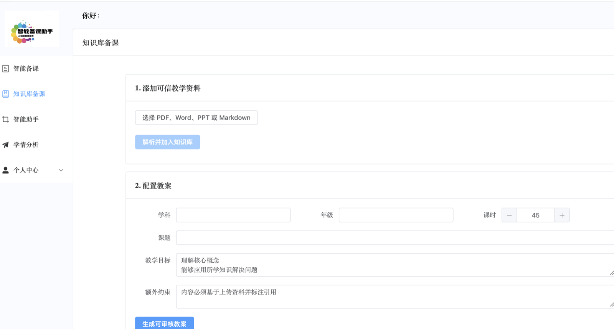

# AI 辅助教师备课系统

面向真实备课流程的生成式 AI 应用。教师可以上传教材、课程标准和教学资料，系统通过混合检索获取可信上下文，再以可控工作流生成带引用的结构化教案。生成结果进入人工审核状态，教师确认、编辑后再保存或导出，避免把模型输出直接当作最终教学内容。

本仓库用于求职作品展示和技术交流。仓库只包含合成演示数据，不包含真实学生信息、私有教材或生产密钥。代码采用 MIT License；界面图片等视觉素材的使用边界见 [ASSET_NOTICE.md](ASSET_NOTICE.md)。



## 核心能力

- 教学知识库：解析 PDF、DOCX、PPTX、XLSX、TXT 和 Markdown，按用户与知识库隔离。
- RAG：文档切片、Embedding、PostgreSQL/pgvector 向量检索、全文检索与混合排序。
- 证据质量门：生成后校验引用是否来自本次检索，并按检索置信度与环节引用覆盖率给出 `PASS/REVIEW`，低置信结果必须人工复核。
- 结构化生成：JSON Schema 约束教案标题、目标、重点难点、教学环节、作业和引用。
- 可控工作流：检索、生成、质量提示与人工审核分阶段执行，失败状态可追踪。
- 模型适配：通过 OpenAI-compatible API 接入 Qwen、DeepSeek 等模型，统一超时和重试。
- 工程治理：JWT 权限隔离、文件校验、Docker Compose、CI、自动化测试和 Prometheus 指标。
- 质量评测：端到端执行入库、检索、生成和引用校验，统计检索命中、拒答准确率、引用覆盖与延迟。

## 系统架构

```text
Vue 3
  │
  ▼
Spring Boot 业务服务
用户 / 教案 / 文件 / 权限 / PPT
  │ 内部鉴权
  ▼
FastAPI AI 服务
模型网关 / Prompt / RAG / Workflow / Evaluation
  │
  ├── Qwen / DeepSeek / OpenAI-compatible model
  ├── PostgreSQL + pgvector（知识库与工作流）
  ├── MySQL（业务数据）
  ├── Redis（缓存与会话）
  └── MinIO（生产环境教学资料对象存储）
```

## 技术栈

- 前端：Vue 3、Vite、Pinia、Vue Router、Element Plus、Axios
- 业务后端：Java 17、Spring Boot 2.7、MyBatis、MySQL、Redis、JWT
- AI 服务：Python 3.12、FastAPI、Pydantic、httpx、pgvector
- AI 与文档：OpenAI-compatible API、DashScope、Apache POI、pypdf、python-docx
- 工程：Docker Compose、GitHub Actions、pytest、Prometheus

## 快速启动

1. 复制环境变量文件并填写模型密钥：`cp .env.example .env`。
2. 修改 `AI_JWT_SECRET`、`AI_INTERNAL_API_KEY`、数据库密码和 `DASHSCOPE_API_KEY`。
3. 运行 `docker compose up --build`。
4. 访问 Web `http://localhost:3000`、AI API 文档 `http://localhost:8000/docs`。

默认 `AI_DEMO_MODE=true`，无需模型密钥即可稳定演示完整可信生成链路；页面会明确标注离线演示结果。使用真实模型时填写 `DASHSCOPE_API_KEY` 并设置 `AI_DEMO_MODE=false`。

演示账号为 `demo_teacher / Demo@2026`，样例资料位于 `demo/八年级一次函数教学资料.md`。完整讲解顺序见 [面试演示手册](docs/demo-guide.md)。

AI 指标位于 `http://localhost:8000/metrics`。演示环境使用本地文件卷；生产环境再切换到受控对象存储。

## 核心使用流程

1. 注册并登录，服务端把用户 ID 写入 JWT。
2. 在“知识库备课”上传可信教学资料。
3. 填写学科、年级、课题、课时、教学目标和额外约束。
4. AI 服务只检索当前用户指定知识库中的资料。
5. 系统生成结构化教案及引用，状态进入 `WAITING_FOR_REVIEW`。
6. 教师核对引用和质量提示，修改后再保存、出题或生成 PPT。

## API

Java 对外接口：

- `POST /knowledge/documents`：上传并索引知识资料。
- `POST /ai/lesson-plan`：生成结构化、带引用的教案。
- 原有教案、习题、PPT、学情与文件接口继续保留。

FastAPI 内部接口：

- `POST /v1/knowledge/files`：解析、切片、向量化并入库。
- `POST /v1/knowledge/documents`：索引纯文本资料。
- `GET /v1/knowledge/documents`、`DELETE /v1/knowledge/documents/{id}`：查看和删除知识库文档；重复内容按哈希去重。
- `POST /v1/workflows/lesson-plan`：执行备课工作流。
- `POST /v1/workflows/lesson-plan/async`、`GET /v1/workflows/{run_id}`：创建后台任务并查询状态。
- `POST /v1/knowledge/documents/{id}/reindex`：重新生成指定文档的向量索引。
- `POST /v1/evaluations/case`：兼容计算单条已保存结果；正式回归使用下方端到端脚本。

生产环境必须设置 `AI_ENVIRONMENT=production` 并配置 `AI_INTERNAL_API_KEY`，禁止将 AI 内部接口直接暴露给公网。

## 测试与评测

```bash
make test
cd ai-service && PYTHONPATH=. python run_evals.py ../evals/datasets/lesson_plan_cases.jsonl
cd ai-service && PYTHONPATH=. python run_real_model_eval.py  # 配置真实模型后生成报告
```

仓库提供 6 条跨学科与拒答案例。脚本会实际执行完整工作流，不读取预先生成的答案或延迟；演示 Provider 的结果只用于回归，不能代表真实模型质量。分层设计与取舍见 [docs/architecture.md](docs/architecture.md)，评测口径见 [docs/evaluation.md](docs/evaluation.md)，安全边界见 [docs/security.md](docs/security.md)。

## 项目结构

```text
ai-service/     FastAPI AI 编排、RAG、模型适配与评测
backend/        Spring Boot 业务服务
frontend/       Vue 3 Web 应用
evals/          离线评测数据集
infra/          pgvector 等基础设施初始化脚本
docs/           架构、评测与安全说明
```

## 当前边界

- 开发环境可以使用内存检索；Docker 环境默认使用 PostgreSQL + pgvector。
- 模型输出必须经过教师审核，系统不替代教师做最终教学判断。
- 没有达到相关性阈值的私有资料时，工作流会拒绝生成，避免无依据教案；阈值可通过 `AI_RETRIEVAL_MIN_SCORE` 调整。
- 成绩分析中的统计计算应使用确定性代码，大模型只负责解释与教学建议。
- 学情分析只读取当前用户拥有的上传文件，并在调用模型前移除学生姓名。
- 生产环境建议把本地文件存储替换为 MinIO，并增加病毒扫描、审计日志和数据删除策略。

## 安全说明

- 公开仓库中的账号和密码仅用于本地演示，不得用于公网环境。
- `.env.example` 中的值均为占位符或本地开发默认值，生产部署必须替换全部密钥和密码。
- 发现安全问题时请按照 [SECURITY.md](SECURITY.md) 私下联系仓库维护者，不要在 Issue 中提交密钥或个人数据。
