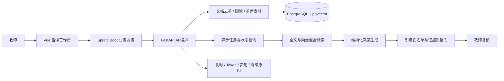

# 架构设计与可信生成链路

## 分层职责

- Vue 只负责资料上传、参数确认、结果编辑和审核状态展示。
- Spring Boot 管理用户、课程、知识库元数据和教案版本，是业务数据的唯一入口。
- FastAPI 负责文档切片、混合检索、模型调用、结构化校验、证据质量门和离线评测。
- 模型通过 Provider 接口接入，工作流不依赖某一家模型；检索通过 Store 接口接入，可在内存演示实现与 PostgreSQL/pgvector 实现之间切换。

这样拆分的原因是，账号权限和业务事务不应与耗时、易变化的模型调用耦合。模型或向量库发生变化时，业务 API 和前端不需要随之改写。

## 一次生成请求

1. Spring Boot 校验用户与知识库权限，通过内部密钥调用 AI 服务。
2. AI 服务在当前租户和知识库范围内执行向量检索与全文检索，再做混合排序。
3. 若没有达到阈值的证据，工作流直接拒绝生成，并返回可解释的失败原因。
4. 模型必须按 Pydantic Schema 返回结构化教案；无法解析时进入失败状态，不保存半成品。
5. 工作流删除不在本次检索结果中的引用，再计算检索置信度和教学环节引用覆盖率。
6. 证据质量门给出 `PASS` 或 `REVIEW`。结果统一进入人工审核，教师确认后才能保存或导出。

## 关键取舍

- 质量门采用确定性规则，不让模型自己判断“是否可信”，因此可以测试、回归和解释。
- `evidence_relevance_score` 是本次入选证据分数的平均值；`citation_coverage` 是含有效引用的教学环节占比。前者不是经过校准的概率，两者也不等同于教学质量。
- 系统保留质量警告而不是自动补写引用，因为自动补写会掩盖证据不足。
- 系统同时提供同步演示接口和带状态查询的后台任务接口。当前后台任务由单进程执行；生产环境应替换为持久化任务队列，并继续增加取消和自动重试策略。
