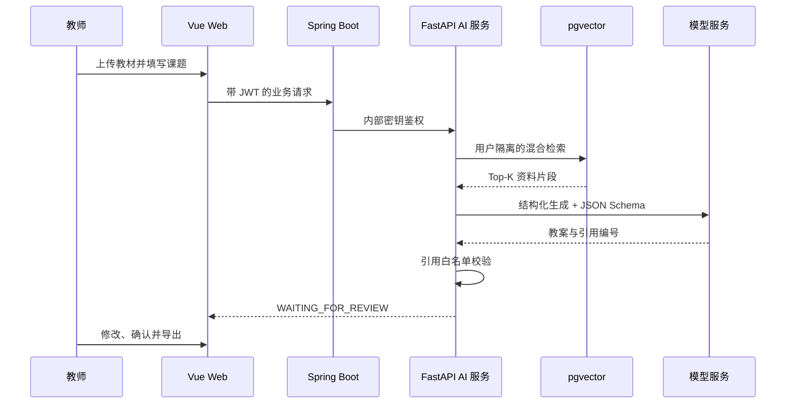

# 面试演示手册

## 推荐脚本（5—7 分钟）

1. 使用演示账号登录，在“知识库备课”上传 `demo/八年级一次函数教学资料.md`。
2. 说明资料按用户和知识库隔离，上传后完成解析、切片和向量化。
3. 输入“数学 / 八年级 / 一次函数 / 45 分钟”，生成结构化教案。
4. 点击教学环节下方的引用编号，定位到对应原文证据。
5. 切换编辑状态，修改一个教学环节，再导出 Word 或打印为 PDF。
6. 补充说明：没有足够相关资料时系统拒绝生成；生产结果必须由教师审核。

## 演示账号

- 用户名：`demo_teacher`
- 密码：`Demo@2026`
- 登录仍需填写页面图片验证码，以保留真实认证流程。

## 模型与兜底

`AI_DEMO_MODE=true` 使用确定性离线提供者，页面会明确显示演示模式警告。它用于避免现场网络和模型额度影响流程，不用于冒充真实模型效果。配置 `DASHSCOPE_API_KEY` 并设置 `AI_DEMO_MODE=false` 后使用真实模型与 Embedding。

## 架构与可信链路

## 现场备用

- 面试前一天执行 `docker compose up --build` 并完整走一遍流程。
- 保留演示模式和真实模型模式各一份截图或录屏。
- 不上传真实学生成绩或包含个人信息的教学资料。
